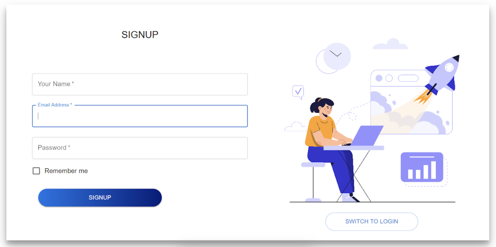

# Employee Management System



[](https://github.com/your-username/employee-management-system/releases)
[](https://github.com/your-username/employee-management-system/blob/main/LICENSE)

## Overview

The Employee Management System is a powerful and intuitive tool to manage your company's workforce efficiently. It simplifies HR tasks, including employee information, attendance, and payroll management.

## Features

- Employee Information Management
- Attendance Tracking
- Payroll Processing
- Leave Management
- Performance Evaluation

## Installation

1. Clone this repository:

   ```sh
   git clone https://github.com/your-username/employee-management-system.git
   ```

2. Install dependencies:

   ```sh
   npm install
   ```

## Usage

1. Start the application:

   ```sh
   npm start
   ```

2. Open the application in your web browser:

   ```sh
   http://localhost:3000
   ```

## Screenshots


## Contributing

We welcome contributions! Please follow our [contribution guidelines](CONTRIBUTING.md) to get started.

---

This Markdown code provides a clean and structured README.md file for your Employee Management System project. Be sure to replace placeholders with your actual logo URL, project information, and screenshots. You can also customize the design and add more sections as needed.
